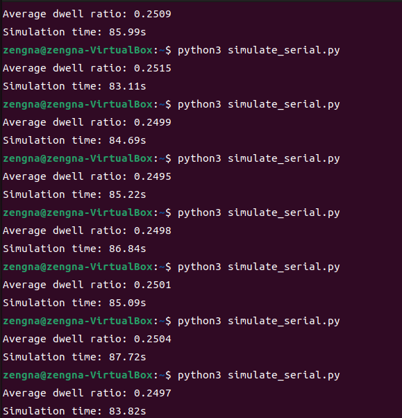
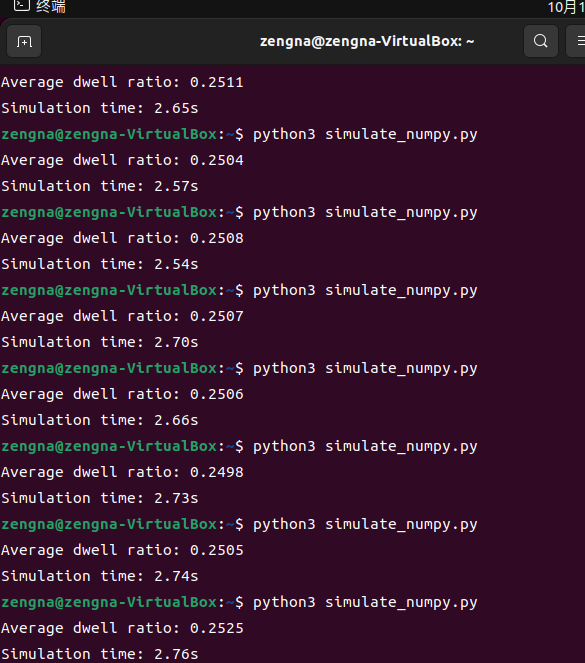
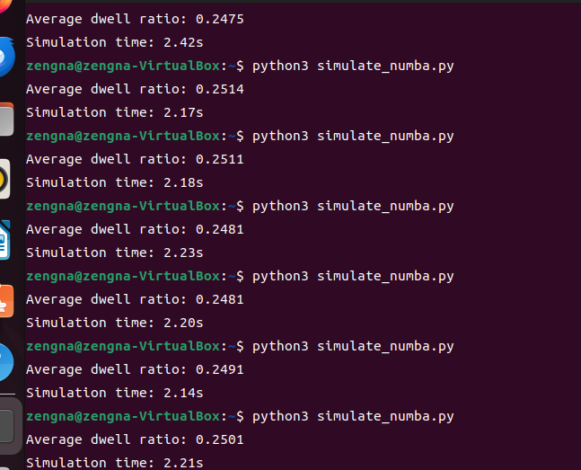
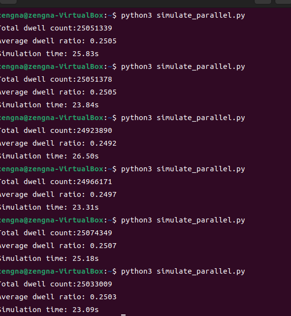
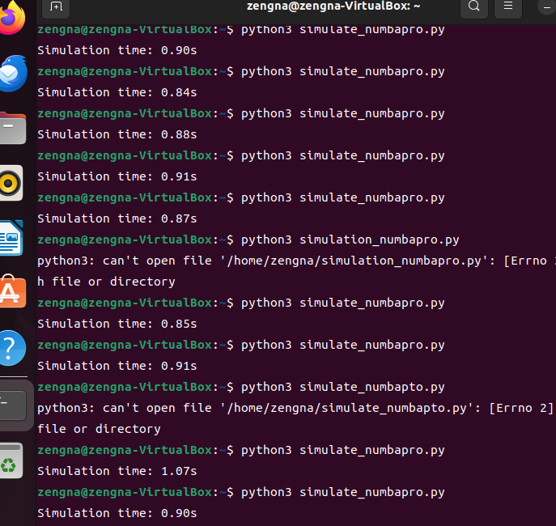

# 粒子随机运动模拟与优化实验报告
## 一．实验目的
- 1.用纯 Python 实现粒子随机运动模拟的串行版本，理解粒子运动的基本逻辑。
- 2.学习并应用 NumPy 库进行向量化优化，提升模拟程序的运行效率。 
- 3.分析算法的时间复杂度，理解优化的原理和效果。 
- 4.尝试实现粒子随机运动模拟的并行版本，进一步提升性能。
## 二．实验环境
- 操作系统：Ubuntu 22.04  
- python版本：Python 3.10 
- 相关库：NumPy（用于高效数组操作，替代python原生列表进行批量生产）、Matplotlib（用于将粒子运动可视化）、Numba（用于 JIT 编译加速，将特定函数编译为机器码，提升计算密集型代码的执行速度）、multiprocessing（用于并行计算，实现多进程同时处理粒子运动计算任务）
## 三、实验原理
#### (一）粒子运动规则
- 每个粒子每步独立随机选择上、下、左、右四个方向之一移动；
- 允许多个粒子占据同一格子（无碰撞约束）；
- 网格采用周期性边界条件，即从右边界走出等同于从左边界进入，从下边界走出等同于从上边界进入。
#### (二）中心区域定义为：
- x ∈ [L/4, 3*L/4) 且 y ∈ [L/4, 3*L/4)；
- 计算公式为所有粒子在中心区域的总步数/粒子总数*模拟总数
## 四、实验步骤
#### 前期准备
虚拟机的安装，是为了可以在自己的电脑上模拟一个独立的 Ubuntu 系统，不用担心操作失误影响本机。
由于第一次接触虚拟机的概念以及自我安装虚拟机，在网上找视频教程下载，也是充满曲折，第一次出错是由于视频太久远，导致找的ubuntu不稳定（不知道这么说准不准确）导致下载很慢，怀疑过自己电脑原因，浪费了很多时间，后来找AI发现可能是其找的文件原因，在镜像站重新找了ubuntu,才终于结束前期工作，也是很命苦了。
#### 步骤 1：纯 Python 串行版本实现（正轨的第一步）
- （1）创建 Python 脚本文件
首先在终端中，使用 touch 命令创建一个名为 simulate_serial.py 的文件，然后使用文本编辑器（gedit）打开该文件，开始写程序，由于我刚开始接触，利用AI写的，码了一遍然后理解了一遍。下面是代码
```
import random //导入该模块，用于生成随机数，在代码中用于确定粒子的移动方向以及初始粒子位置
import time//用于记录时间
L = 512   
N = 100000  
T = 1000 


particles_x = [random.randint(0, L - 1) for _ in range(N)]
particles_y = [random.randint(0, L - 1) for _ in range(N)]

//这两行代码使用的是列表推导式，为N个粒子分别在x和y方向上随机生成初始位置，范围是从0到L - 1，确保粒子初始位置在定义的方形区域内。

start_time = time.time()  //调用time.time()函数，记录模拟开始的时间，用于后续计算模拟总时长。
dwell_count = 0  //dwell_count，用于统计粒子处于特定区域内的总次数。

for t in range(T)://这是一个外层循环，循环T次，代表模拟进行T个时间步，每个时间步内会对所有粒子进行一次位置更新和状态判断。
    current_dwell = 0  //该函数用于统计当前时间步内粒子处于特定区域内的次数。
    for i in range(N)://这是内层循环，循环N次，对每个粒子进行操作，包括确定移动方向和更新位置。
       
        direction = random.randint(0, 3)//direction，代表粒子的移动方向，不同的数值对应不同的移动方向。
        if direction == 0:
            particles_y[i] = (particles_y[i] - 1) % L
        elif direction == 1:
            particles_y[i] = (particles_y[i] + 1) % L
        elif direction == 2:
            particles_x[i] = (particles_x[i] - 1) % L
        else:
            particles_x[i] = (particles_x[i] + 1) % L
        
        if (L // 4 <= particles_x[i] < 3 * L // 4) and (L // 4 <= particles_y[i] < 3 * L // 4):
            current_dwell += 1
    dwell_count += current_dwell//判断当前粒子是否位于方形区域的中间部分，如果是，就将current_dwell加1。在遍历完所有粒子后，将当前时间步的current_dwell累加到dwell_count中，统计所有时间步内粒子处于中间区域的总次数。

end_time = time.time()  
simulation_time = end_time - start_time
average_dwell_ratio = dwell_count / (N * T)//计算每个粒子在每个时间步内处于中间区域的平均次数，用总次数dwell_count除以粒子数N与时间步数T的乘积。


print(f"Average dwell ratio: {average_dwell_ratio:.4f}")
print(f"Simulation time: {simulation_time:.2f}s")
```
#### 结果展示

#### 结果分析
- 平均驻留率：
多次运行结果显示平均驻留率0.2482-0.2519之间波动，整体处于相对稳定的范围。
- 模拟时间：
模拟时间在83.21-86.32秒之间变化，每次运行慢。
- 原因：纯 Python 串行版本中，外层循环是模拟步数 
内层循环是粒子数量 每次内层循环中还有固定次数的操作（如判断方向、更新位置、判断中心区域等）。所以当 T和 N较大时，运行时间会很长。
#### 步骤 2：进行NumPy 向量化优化
- （1）创建并编写 NumPy 优化的Python 文件
- 以下为代码
```
import numpy as np//导入 NumPy 库，并将其别名为np。
import time

L = 512
N = 100000
T = 1000
particles_x = np.random.randint(0, L, size=N)//使用 NumPy 的random.randint函数，生成N个在[0, L)范围内的随机整数，作为粒子的初始x坐标，存储在 NumPy 数组particles_x中。
particles_y = np.random.randint(0, L, size=N)

start_time = time.time()
dwell_count = 0

for t in range(T):
    directions = np.random.randint(0, 4, size=N)//在每个时间步中，为每个粒子生成一个[0,4)范围内的随机整数，表示粒子的移动方向，存储在directions数组中。
    particles_x = np.where(directions == 2, (particles_x - 1) % L, particles_x)//使用np.where函数，对directions数组进行判断，当方向为 2 时，粒子的x坐标减 1 后对L取模（实现周期性边界条件），否则保持原x坐标。
    particles_x = np.where(directions == 3, (particles_x + 1) % L, particles_x)
    particles_y = np.where(directions == 0, (particles_y - 1) % L, particles_y)
    particles_y = np.where(directions == 1, (particles_y + 1) % L, particles_y)
    in_center = ((L // 4 <= particles_x) & (particles_x < 3 * L // 4) & 
                 (L // 4 <= particles_y) & (particles_y < 3 * L // 4))//通过布尔数组运算，判断每个粒子是否在中心区域（x和y坐标都在[L//4, 3L//4)范围内），结果存储在布尔数组in_center中。
    current_dwell = np.sum(in_center)//np.sum是向量化的求和操作  
    dwell_count += current_dwell

end_time = time.time()
simulation_time = end_time - start_time
average_dwell_ratio = dwell_count / (N * T)

print(f"Average dwell ratio: {average_dwell_ratio:.4f}")
print(f"Simulation time: {simulation_time:.2f}s")

```
- 结果展示

- 结果分析
从结果来看，模拟时间变快，从最初的python83s下降到2.6s左右。原因可能是：
NumPy 利用向量化操作，避免了纯 Python 中大量的循环,向量化操作是对整个数组进行批量处理，底层由 C 语言高效实现，减少了 Python 解释器的循环开销。

#### 步骤三：安装 Numba，进行numba JIT的编译优化。
- 创建并编写代码文件：gedit simulate_numba.py。
- 以下为代码：
```
import numpy as np
import time
from numba import jit//从 numba 库中导入 jit 装饰器，jit可以将 Python 函数编译为机器码，提升执行速度。

@jit(nopython=True)//使用 jit 装饰器，nopython=True 表示尽可能使用纯机器码执行，避免回退到 Python 解释器执行，以获得更好的性能。
def simulate(L, N, T)://定义名为 simulate 的函数，参数 L 可能是模拟空间的边长，N 是粒子数量，T 是模拟的时间步数。
    particles_x = np.random.randint(0, L, size=N)//生成 N 个范围在 [0, L) 内的随机整数，作为粒子在 x 方向的初始位置，存储在 particles_x 数组中。利用 NumPy 的向量化操作，一次性生成所有粒子的 x 坐标。
    particles_y = np.random.randint(0, L, size=N)
    dwell_count = 0
    for t in range(T):
        current_dwell = 0
        for i in range(N):
            direction = np.random.randint(0, 4)
            if direction == 0:
                particles_y[i] = (particles_y[i] - 1) % L
            elif direction == 1:
                particles_y[i] = (particles_y[i] + 1) % L
            elif direction == 2:
                particles_x[i] = (particles_x[i] - 1) % L
            else:
                particles_x[i] = (particles_x[i] + 1) % L
            if (L // 4 <= particles_x[i] < 3 * L // 4) and (L // 4 <= particles_y[i] < 3 * L // 4):
                current_dwell += 1
        dwell_count += current_dwell
    return dwell_count

L = 512
N = 100000
T = 1000

start_time = time.time()
dwell_count = simulate(L, N, T)
end_time = time.time()

simulation_time = end_time - start_time
average_dwell_ratio = dwell_count / (N * T)

print(f"Average dwell ratio: {average_dwell_ratio:.4f}")
print(f"Simulation time: {simulation_time:.2f}s")
```
- 结果展示
 
- 结果分析
- 最快达到了2。1s左右，原因是不仅加入了NumPy 向量化操作，还增加了Numba JIT 编译，通过 @jit(nopython=True) 装饰器，Numba 将 simulate 函数编译为机器码。机器码可以直接被 CPU 执行，不需要像 Python 字节码那样经过解释器逐行解释执行，从而提升了函数的执行速度
#### 阶段 4：另一思路：多进程并行优化
- （一）操作步骤
创建并编写代码文件gedit simulate_parallel.py。
代码如下：
```
import numpy as np
from multiprocessing import Pool, cpu_count//从multiprocessing模块中导入Pool（用于创建进程池，实现多进程并行计算）和cpu_count（用于获取 CPU 核心数量）
import ctypes//导入ctypes模块，ctypes是 Python 的外部函数库，用于与 C 语言编写的动态链接库等进行交互，这里用于处理共享内存相关操作。
from multiprocessing import Array//从multiprocessing模块中导入Array，用于创建可在进程间共享的数组。
import time
L = 512
N = 100000
T = 100

all_particles_x_shared = Array(ctypes.c_double, N)//创建一个类型为ctypes.c_double、长度为N的共享数组all_particles_x_shared，用于存储所有粒子的 x 坐标，供多个进程共享访问。
all_particles_y_shared = Array(ctypes.c_double, N)
all_particles_x = np.frombuffer(all_particles_x_shared.get_obj())//
all_particles_y = np.frombuffer(all_particles_y_shared.get_obj())
all_particles_x[:] = np.random.rand(N) * L//将all_particles_x_shared转换为 NumPy 数组，并利用np.random.rand(N)生成N个[0,1)之间的随机数，乘以L后赋值给该数组，作为粒子初始的 x 坐标。
all_particles_y[:] = np.random.rand(N) * L
directions = np.random.randint(0, 4, size=(T, N))//生成一个形状为(T, N)的数组directions，其中每个元素是[0,4)范围内的随机整数，代表每个时间步、每个粒子的移动方向。
def process_particles(process_id)://定义处理粒子的函数process_particles，参数process_id用于标识进程。
    global L, T, N, directions, all_particles_x, all_particles_y
    num_cores = cpu_count()
    particles_per_process = N // num_cores//计算每个进程处理的粒子数量，为总粒子数N除以 CPU 核心数num_cores。
    if process_id == num_cores - 1://判断当前进程是否是最后一个进程。
        particles_per_process += N % num_cores//如果是最后一个进程，将剩余的粒子（N % num_cores）分配给它，确保所有粒子都被处理。
    
    start_idx = process_id * (N // num_cores)//计算当前进程处理粒子的起始索引。
    end_idx = start_idx + particles_per_process//计算当前进程处理粒子的结束索引。
    
    particles_x = all_particles_x[start_idx:end_idx]//从共享数组all_particles_x中获取当前进程要处理的粒子 x 坐标子数组。
    particles_y = all_particles_y[start_idx:end_idx]
    dwell_count = 0
    
    for t in range(T):
        current_dwell = 0
        dir_t = directions[t, start_idx:end_idx]//获取当前时间步、当前进程处理粒子对应的移动方向子数组。
        for i in range(len(particles_x))://内层循环，遍历当前进程处理的每个粒子。
            direction = dir_t[i]//获取当前粒子的移动方向。
            if direction == 0:
                particles_y[i] = (particles_y[i] - 1) % L
            elif direction == 1:
                particles_y[i] = (particles_y[i] + 1) % L
            elif direction == 2:
                particles_x[i] = (particles_x[i] - 1) % L
            else:
                particles_x[i] = (particles_x[i] + 1) % L
            if (L / 4 <= particles_x[i] < 3 * L / 4) and (L / 4 <= particles_y[i] < 3 * L / 4):
                current_dwell += 1
        dwell_count += current_dwell
    return dwell_count

if __name__ == "__main__"://判断是否是主模块运行。
    num_cores = cpu_count()
    process_args = [i for i in range(num_cores)]//生成进程参数列表，每个进程对应一个索引i。
    start_time = time.time()
    
    with Pool(processes=num_cores) as pool://创建进程池，进程数量为num_cores。
        results = pool.map(process_particles, process_args)//使用进程池的map方法，将process_particles函数应用到process_args中的每个参数上，进行多进程并行计算，得到各进程的结果results。
    
    dwell_count = sum(results)//将各进程的结果求和，得到总的停留次数。
    average_dwell_ratio = dwell_count / (N * T)
    simulation_time = end__time - start_time
    
    print(f"Total dwell count: {dwell_count}")
    print(f"Average dwell ratio: {average_dwell_ratio:.4f}")
    print(f"Simulation time: {simulation_time:.2f}s")
```


结果分析
本来以为会比利用numpy方法,查阅资料了解比 NumPy 慢的原因是虽然使用了多进程并行计算，但多进程之间存在进程创建、通信、同步等开销。当问题规模不是特别大时，这些开销可能会抵消甚至超过多进程带来的并行加速收益。
第二是代码中仍然存在较多的 Python 循环，Python 的循环是解释执行的，速度较慢。而 NumPy 的优势在于向量化操作，能够将循环转换为底层的批量计算，避免了 Python 解释器的循环开销。
#### 本人的杀手锏（numba JIT + 多进程并行）
```
import numpy as np
import time
from numba import jit
from multiprocessing import Pool, cpu_count

L = 512
N = 100000
T = 1000
num_cores = cpu_count() //调用 cpu_count 函数获取 CPU 的核心数量，并将其赋值给 num_cores。
particles_per_core = N // num_cores//计算每个 CPU 核心分配到的粒子数量，通过将粒子总数 N 整除 CPU 核心数 num_cores 得到。
@jit(nopython=True)//使用 @jit 装饰器对 core_simulate 函数进行装饰，nopython=True 表示使用纯机器码编译，不回退到 Python 解释器，以提高函数执行速度。core_simulate 函数用于模拟单个核心上粒子的运动过程，参数 particles_x 和 particles_y 分别是粒子的 x 和 y 坐标数组，L 是模拟空间边长，T 是时间步数。
def core_simulate(particles_x, particles_y, L, T):
    dwell_count = 0
    quarter_L = L // 4//计算模拟空间边长的四分之一，赋值给 quarter_L。
    three_quarter_L = 3 * L // 4
    for t in range(T):
        current_dwell = 0
        for i in range(len(particles_x))://遍历每个粒子，len(particles_x) 是粒子的数量。
            direction = np.random.randint(0, 4)
            if direction == 0:
                particles_y[i] = (particles_y[i] - 1) % L
            elif direction == 1:
                particles_y[i] = (particles_y[i] + 1) % L
            elif direction == 2:
                particles_x[i] = (particles_x[i] - 1) % L
            else:
                particles_x[i] = (particles_x[i] + 1) % L
            if (quarter_L <= particles_x[i] < three_quarter_L) and (quarter_L <= particles_y[i] < three_quarter_L):
                current_dwell += 1
        dwell_count += current_dwell
    return dwell_count

def worker(process_id)://定义 worker 函数，用于在每个进程中执行模拟任务，process_id 是进程的 ID。
    start = process_id * particles_per_core//计算当前进程处理的粒子起始索引，通过进程 ID 乘以每个核心分配的粒子数得到。
    end = start + particles_per_core//计算当前进程处理的粒子起始索引，通过进程 ID 乘以每个核心分配的粒子数得到。
    particles_x = np.random.randint(0, L, size=particles_per_core)//生成当前进程处理的粒子的 x 坐标数组，是 0 到 L-1 之间的随机整数，数量为 particles_per_core。
    particles_y = np.random.randint(0, L, size=particles_per_core)
    return core_simulate(particles_x, particles_y, L, T)//调用 core_simulate 函数，传入当前进程的粒子坐标、L 和 T，并返回结果。
start_time = time.time()//记录程序开始执行的时间。
with Pool(num_cores) as pool://创建一个进程池，进程数量为 num_cores，使用 with 语句可以确保进程池在使用完毕后正确关闭。
    total_dwell = sum(pool.map(worker, range(num_cores)))//使用进程池的 map 方法，将 worker 函数应用到 range(num_cores) 中的每个元素（即每个进程 ID），然后将所有进程的结果求和，得到总停留计数 total_dwell。
end_time = time.time()

print(f"simulation time：{end_time - start_time:.2f}秒")
```
结果展示：

结果说明：将numba 即时编译和多进程并行计算以及numpy 向量化的buff叠加，使其速度很快。